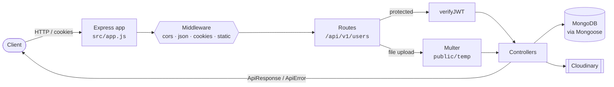
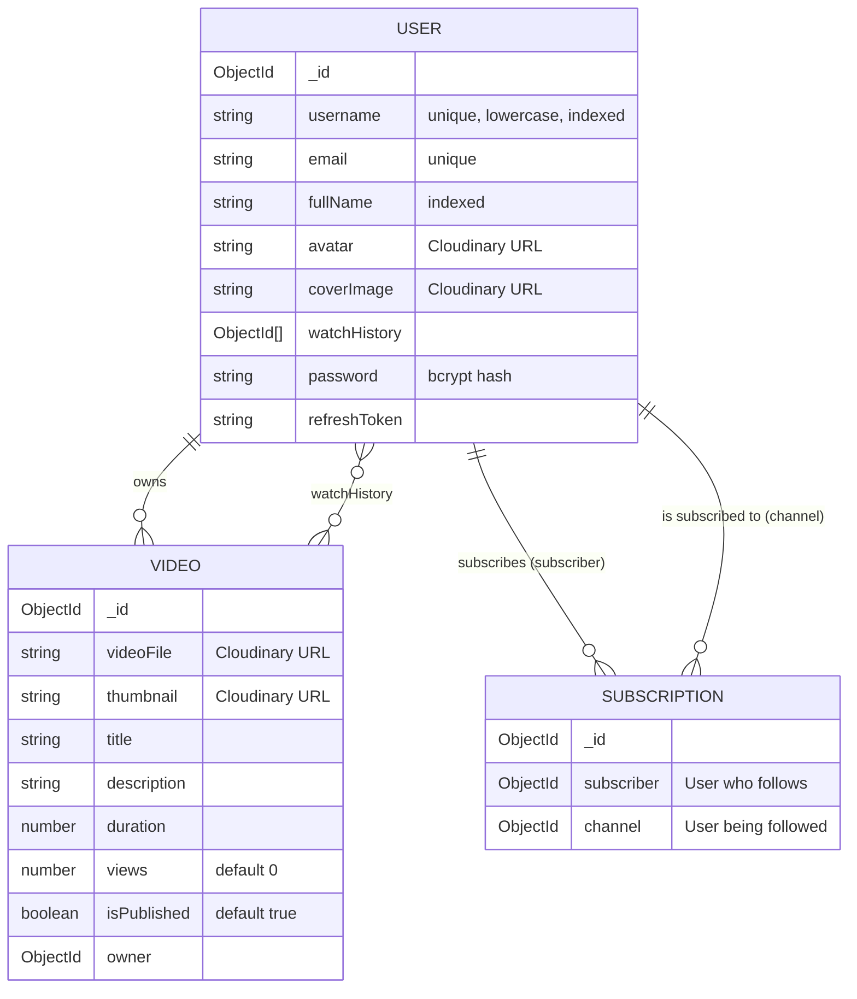
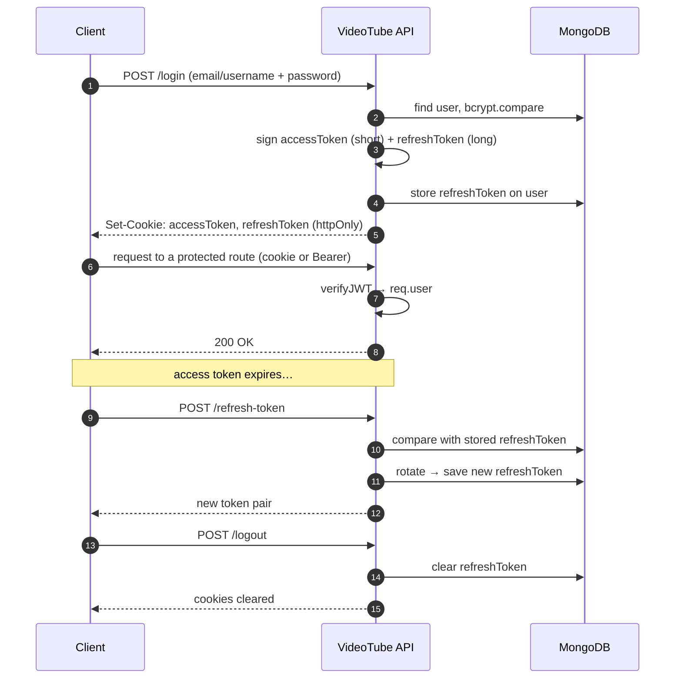

<div align="center">

# 🎬 VideoTube

**A video-sharing platform backend — accounts, channels, subscriptions and media uploads, built on Node.js, Express and MongoDB.**


[**Overview**](#-overview) ·
[**Architecture**](#-architecture) ·
[**Quick start**](#-quick-start) ·
[**API explorer**](#-api-explorer) ·
[**Data model**](#-data-model) ·
[**Auth flow**](#-how-authentication-works) ·
[**Roadmap**](#-roadmap)

</div>

---

## 👋 Overview

VideoTube is the backend for a YouTube-style platform. Users sign up with an avatar and cover image, log in with either their username or email, and stay signed in through a short-lived access token paired with a rotating refresh token. Media is stored on Cloudinary, so the API server never has to hold onto files.

<table>
<tr>
<td width="33%" valign="top">

### 🔐 Secure by default
Passwords are hashed with **bcrypt**. Sessions use **JWT access + refresh tokens** sent as `httpOnly` cookies, and refresh tokens are checked against the copy stored in the database.

</td>
<td width="33%" valign="top">

### ☁️ Cloud media
Uploads go through **Multer** to a temp folder, then to **Cloudinary**. The local file is deleted whether the upload succeeds or fails.

</td>
<td width="33%" valign="top">

### 🧱 Consistent API
Every endpoint returns the same `ApiResponse` / `ApiError` envelope, and every controller is wrapped in `asyncHandler`, so there's no scattered `try/catch`.

</td>
</tr>
</table>

> [!TIP]
> Every section below folds open. Click any **▶ arrow** to expand it.

---

## 🏗 Architecture



<details>
<summary><b>📂 Explore the project structure</b></summary>

```text
videoTube/
├── public/
│   └── temp/                    # Multer staging area before Cloudinary upload
└── src/
    ├── index.js                 # Entry point: loads env, connects DB, starts server
    ├── app.js                   # Express app + global middleware + route mounting
    ├── constants.js             # DB_NAME
    ├── db/
    │   └── index.js             # Mongoose connection
    ├── routes/
    │   └── user.routes.js       # /api/v1/users/*
    ├── controllers/
    │   └── user.controller.js   # Auth + account management logic
    ├── middlewares/
    │   ├── auth.middleware.js   # verifyJWT — reads cookie or Bearer token
    │   └── multer.middleware.js # Disk storage for incoming files
    ├── models/
    │   ├── user.model.js        # User + password hashing + token generation
    │   ├── video.model.js       # Video (paginated aggregation plugin)
    │   └── subscription.model.js# Subscriber ↔ channel relationship
    └── utils/
        ├── ApiError.js          # Standard error shape
        ├── ApiResponse.js       # Standard success shape
        ├── AsyncHandler.js      # Promise wrapper for controllers
        └── cloudinary.js        # uploadOnCloudinary()
```

</details>

<details>
<summary><b>🧩 What happens to a request, layer by layer</b></summary>

| Step | Layer | What it does |
|:---:|---|---|
| 1 | `cors` | Allows only `CORS_ORIGIN`, with credentials (cookies) enabled |
| 2 | `express.json` / `urlencoded` | Parses request bodies, capped at **16kb** |
| 3 | `cookieParser` | Exposes `req.cookies` so tokens can be read from cookies |
| 4 | Router | Matches `/api/v1/users/...` |
| 5 | `verifyJWT` *(protected routes only)* | Verifies the token and attaches `req.user` |
| 6 | `upload` *(file routes only)* | Saves files to `public/temp` |
| 7 | Controller | Business logic, wrapped in `asyncHandler` |
| 8 | Response | `ApiResponse` on success, `ApiError` on failure |

</details>

---

## 🚀 Quick start

<details open>
<summary><b>Step 1 — Clone & install</b></summary>

```bash
git clone <your-repo-url> videoTube
cd videoTube
npm install
```

</details>

<details>
<summary><b>Step 2 — Configure environment</b></summary>

Create a `.env` file in the project root:

```env
PORT=8000
MONGODB_URI=mongodb+srv://<user>:<password>@<cluster>.mongodb.net
CORS_ORIGIN=http://localhost:3000

ACCESS_TOKEN_SECRET=<long-random-string>
ACCESS_TOKEN_EXPIRY=1d
REFRESH_TOKEN_SECRET=<another-long-random-string>
REFRESH_TOKEN_EXPIRY=10d

CLOUDINARY_CLOUD_NAME=<cloud-name>
CLOUDINARY_API_KEY=<api-key>
CLOUDINARY_API_SECRET=<api-secret>
```

| Variable | Required | Purpose |
|---|:---:|---|
| `PORT` | – | Server port (defaults to `8000`) |
| `MONGODB_URI` | ✅ | MongoDB connection string **without** a database name. `videoTube` is appended automatically |
| `CORS_ORIGIN` | ✅ | Frontend origin allowed to send credentials |
| `ACCESS_TOKEN_SECRET` / `_EXPIRY` | ✅ | Signing secret and lifetime for short-lived access tokens |
| `REFRESH_TOKEN_SECRET` / `_EXPIRY` | ✅ | Signing secret and lifetime for long-lived refresh tokens |
| `CLOUDINARY_*` | ✅ | Credentials for media uploads |

> [!TIP]
> Generate a strong secret with `node -e "console.log(require('crypto').randomBytes(64).toString('hex'))"`

</details>

<details>
<summary><b>Step 3 — Run it</b></summary>

```bash
npm run dev
```

You should see:

```text
 MongoDB connected ! DB host: <your-cluster-host>
⚙️ Server is running at port : 8000
```

</details>

---

## 🧪 API explorer

Base URL: `http://localhost:8000/api/v1/users`

| Method | Endpoint | Auth | Status |
|:---:|---|:---:|:---:|
|  | [`/register`](#post-register) | – | 🚧 |
|  | [`/login`](#post-login) | – | ✅ |
|  | [`/logout`](#post-logout) | 🔒 | ✅ |
|  | [`/refresh-token`](#post-refresh-token) | 🍪 | ✅ |
| – | [Account management](#account-management) | 🔒 | 🚧 |

<sub>✅ routed and live · 🚧 controller written, route being wired up · 🔒 needs access token · 🍪 needs refresh token</sub>

<a id="post-register"></a>
<details>
<summary><b><code>POST /register</code></b> — create an account with avatar & cover image</summary>

**Body:** `multipart/form-data`

| Field | Type | Required |
|---|---|:---:|
| `fullName` | text | ✅ |
| `email` | text | ✅ |
| `username` | text | ✅ |
| `password` | text | ✅ |
| `avatar` | file | ✅ |
| `coverImage` | file | – |

```bash
curl -X POST http://localhost:8000/api/v1/users/register \
  -F "fullName=Jane Doe" \
  -F "email=jane@example.com" \
  -F "username=janedoe" \
  -F "password=secret123" \
  -F "avatar=@./avatar.png" \
  -F "coverImage=@./cover.png"
```

**What happens inside:**
1. Checks that no field is empty
2. Rejects duplicate username or email → `409`
3. Uploads the avatar (and cover image, if provided) to Cloudinary
4. Creates the user. The password is hashed by a `pre("save")` hook
5. Returns the user without `password` or `refreshToken` → `201`

</details>

<a id="post-login"></a>
<details>
<summary><b><code>POST /login</code></b> — sign in with username <i>or</i> email</summary>

```bash
curl -X POST http://localhost:8000/api/v1/users/login \
  -H "Content-Type: application/json" \
  -c cookies.txt \
  -d '{"email":"jane@example.com","password":"secret123"}'
```

**Response** `200`, plus `accessToken` and `refreshToken` set as `httpOnly` cookies:

```json
{
  "statusCode": 200,
  "data": {
    "user": { "_id": "...", "username": "janedoe", "email": "jane@example.com", "fullName": "Jane Doe", "avatar": "https://res.cloudinary.com/..." },
    "accessToken": "eyJhbGciOi...",
    "refreshToken": "eyJhbGciOi..."
  },
  "message": "User logged In Successfully",
  "success": true
}
```

| Error | When |
|---|---|
| `400` | Neither username nor email provided |
| `404` | No matching user |
| `401` | Wrong password |

</details>

<a id="post-logout"></a>
<details>
<summary><b><code>POST /logout</code></b> 🔒 — end the session</summary>

```bash
curl -X POST http://localhost:8000/api/v1/users/logout -b cookies.txt
# or
curl -X POST http://localhost:8000/api/v1/users/logout -H "Authorization: Bearer <accessToken>"
```

Clears the stored refresh token in the database and removes both cookies.

</details>

<a id="post-refresh-token"></a>
<details>
<summary><b><code>POST /refresh-token</code></b> 🍪 — get a fresh token pair</summary>

The refresh token is read from the `refreshToken` cookie, or from `{ "refreshToken": "..." }` in the body.

```bash
curl -X POST http://localhost:8000/api/v1/users/refresh-token -b cookies.txt -c cookies.txt
```

The incoming token must match the one stored on the user. Each refresh **rotates** the token, so an old refresh token can't be reused.

</details>

<a id="account-management"></a>
<details>
<summary><b>Account management</b> 🔒 — password, profile, avatar, cover image</summary>

These controllers are written and are being connected to routes:

| Controller | Purpose | Input |
|---|---|---|
| `changeCurrentPassword` | Change password after checking the old one | `{ oldPassword, newPassword }` |
| `getCurrentUser` | Return the signed-in user | – |
| `updateAccountDetails` | Update name and email | `{ fullName, email }` |
| `updateUserAvatar` | Replace the avatar | `avatar` file |
| `updateUserCoverImage` | Replace the cover image | `coverImage` file |

</details>

<details>
<summary><b>📦 Response envelope</b> — the same shape everywhere</summary>

**Success** (`ApiResponse`)
```json
{ "statusCode": 200, "data": { }, "message": "Success", "success": true }
```

**Error** (`ApiError`)
```json
{ "statusCode": 401, "data": null, "message": "Unauthorized request", "success": false, "errors": [] }
```

`success` is derived automatically: `statusCode < 400`.

</details>

---

## 🗄 Data model



<details>
<summary><b>💡 Why is a subscription its own document?</b></summary>

A channel can have millions of subscribers. Storing them in an array on the user would bloat the document and eventually hit MongoDB's 16MB limit. Instead, each subscription is a small `{ subscriber, channel }` document:

- **Subscriber count of channel X** → count documents where `channel = X`
- **Channels user Y follows** → find documents where `subscriber = Y`

Both are simple queries and fit naturally into aggregation pipelines.

</details>

<details>
<summary><b>💡 Why the aggregate-paginate plugin on videos?</b></summary>

`mongoose-aggregate-paginate-v2` adds pagination to aggregation pipelines. Feeds, search results and channel pages can join owner details, filter unpublished videos and still return paged results in a single query.

</details>

---

## 🔑 How authentication works



<details>
<summary><b>🛡 Security decisions</b></summary>

| Decision | Why |
|---|---|
| `httpOnly` + `secure` cookies | JavaScript in the browser can't read the tokens, which limits the damage from XSS |
| Also accepts `Authorization: Bearer` | Lets mobile and non-browser clients authenticate |
| Refresh token stored server-side | Logging out actually revokes the session |
| Token rotation on refresh | A stolen refresh token stops working after its next legitimate use |
| `password` & `refreshToken` stripped from responses | Secrets never leave the server |
| 16kb body limit | Rejects oversized JSON payloads early |

</details>

---

## 🗺 Roadmap

- [x] Project scaffolding, DB connection, global middleware
- [x] `User`, `Video`, `Subscription` models
- [x] Password hashing & JWT generation on the model
- [x] Cloudinary upload utility with temp-file cleanup
- [x] Login, logout, refresh-token endpoints
- [x] Account management controllers
- [ ] Wire `/register` and account-management routes
- [ ] Channel profile (subscriber / subscribed-to counts via aggregation)
- [ ] Watch history
- [ ] Video upload, publish toggle, update, delete
- [ ] Paginated video feed & search
- [ ] Likes, comments, playlists, tweets
- [ ] Frontend client

---

## 🧰 Tech stack

<details>
<summary><b>See every dependency and what it's for</b></summary>

| Package | Role |
|---|---|
| `express` | HTTP server and routing |
| `mongoose` | MongoDB ODM and schemas |
| `mongoose-aggregate-paginate-v2` | Paginated aggregation queries |
| `jsonwebtoken` | Signing and verifying access/refresh tokens |
| `bcrypt` | Password hashing |
| `multer` | Multipart file handling |
| `cloudinary` | Media storage and CDN |
| `cors` | Cross-origin policy |
| `cookie-parser` | Reading cookies from requests |
| `dotenv` | Environment configuration |
| `nodemon` | Auto-reload in development |
| `prettier` | Code formatting |

</details>

---

<div align="center">

Built by **Samarth Sharma**

<a href="#-videotube">⬆ Back to top</a>

</div>
